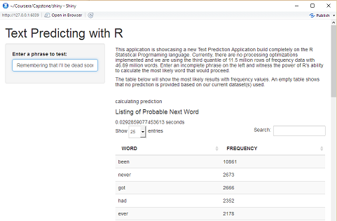

## Algorithm

# We'll be using probabilistic models built on sequences of text of lengths -N- (n-grams).

# Using conglomerate of data to capture varying representations of text combinations
  * Data from US News, US Blogs, and Twitter
  * 102 million words
  * 4.27 million lines
  
# Resulting 3 tables of 2-gram (bigram), 3-gram (trigram), and 4-gram (quadgram)
  * 65823672 bigrams detected
  * 62508808 trigrams detected
  * 59294385 quadgrams detected
  

--- .class #id 

## Algorithm (cont...)

* High frequency valued n-grams can be found in third quantile.
* System used the third quantile of data to build the lookup tables
* Shorter lookup tables, faster performance

---

## Implementation

# User interface incorporated into shiny 

# Takes a brief moment to load libraries 

# As User types, predictions are calculated and displayed in a table sorted by frequency 

# Table of values can be searched or sorted to User's liking 

---

##  Performance

# Assume someone enters text on a mobile device at 40 WPM

* 1.5 words a second

# Application takes average of 0.05 seconds (5 milliseconds) to return a list of words

* List of ngram values done before deployment, lessens computation time
* Further refinement is possible by decreasing the quantity of values returned

# Application can be modified to benefit other purposes where ngrams can be applied

---

 
 
 
 

##  THANK YOU

